<h1 align="center"><b> COLLEGE MADE SIMPLER </b></h1>
<h3 align="center"><b> Inweb-2.0 Hackathon Winners </b></h3>

  
   
    
  
 
  

## About:

COLLEGE MADE SIMPLER - A web-app which help students to find automated blogs, courses and create polls on important issues which are going on in college in order to gain idea of what other students have to say about them and also how many students are in support of the cause. It helps in connecting large number of students, make them aware of the issues and help them come together.

## Quick Glance

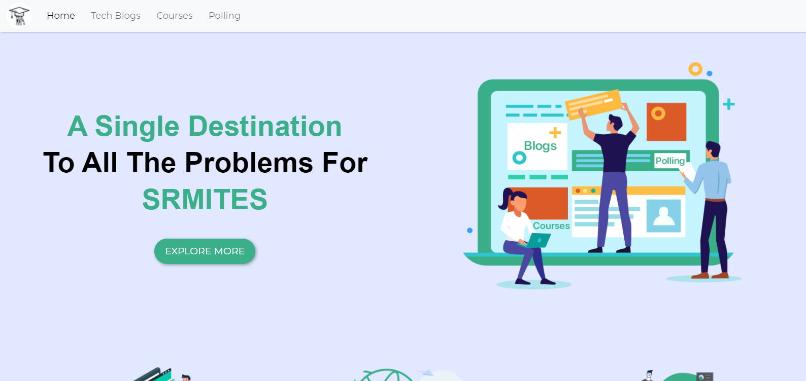 &ensp;&ensp;&ensp;&ensp;&ensp;&ensp;&ensp;&ensp;&ensp;
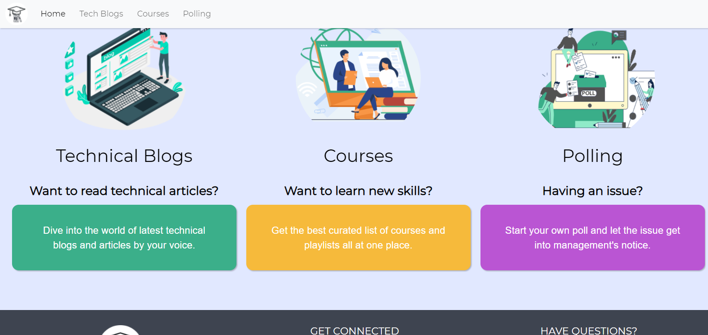 &ensp;&ensp;&ensp;&ensp;&ensp;&ensp;&ensp;&ensp;&ensp; 
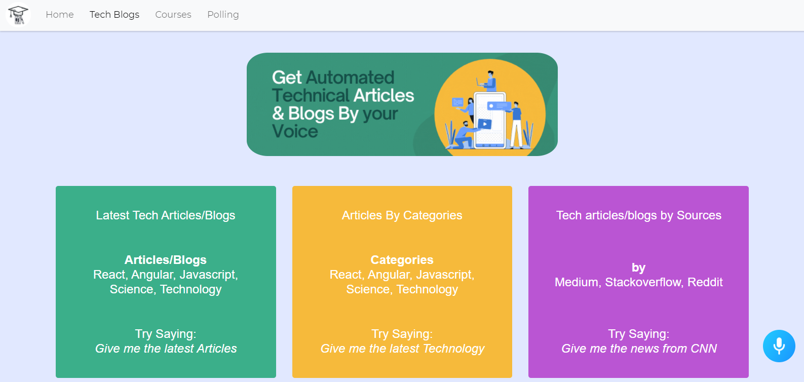 &ensp;&ensp;&ensp;&ensp;&ensp;&ensp;&ensp;&ensp;&ensp;
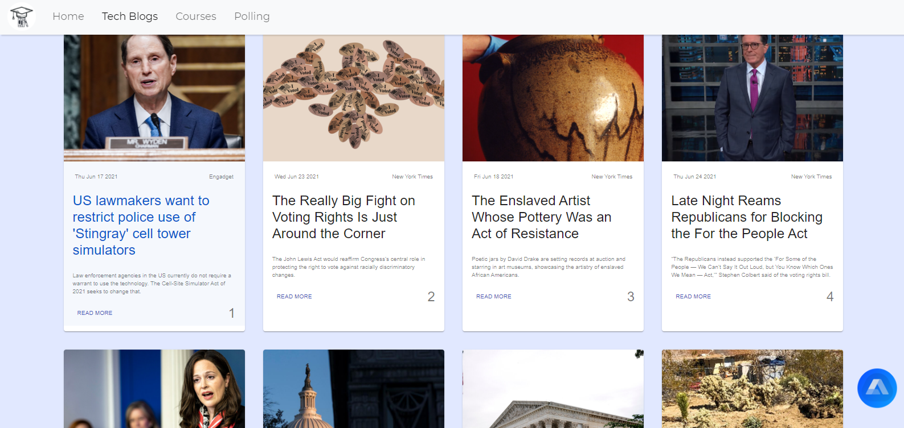 &ensp;&ensp;&ensp;&ensp;&ensp;&ensp;&ensp;&ensp;&ensp;
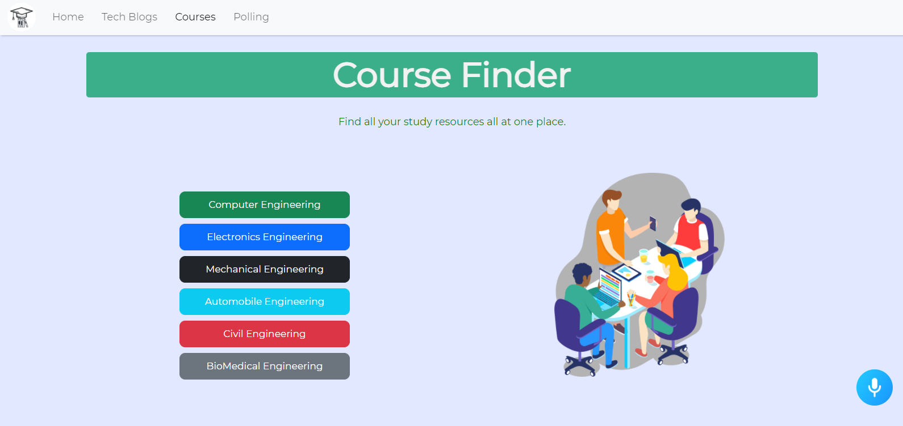 &ensp;&ensp;&ensp;&ensp;&ensp;&ensp;&ensp;&ensp;&ensp;
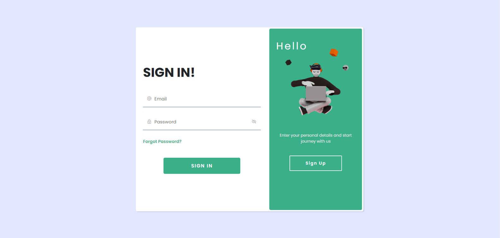 &ensp;&ensp;&ensp;&ensp;&ensp;&ensp;&ensp;&ensp;&ensp;
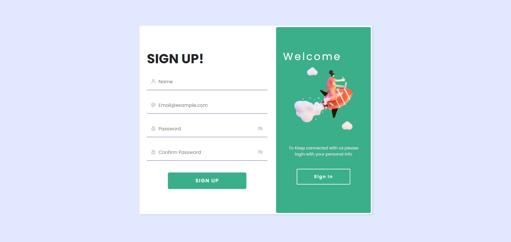 &ensp;&ensp;&ensp;&ensp;&ensp;&ensp;&ensp;&ensp;&ensp;
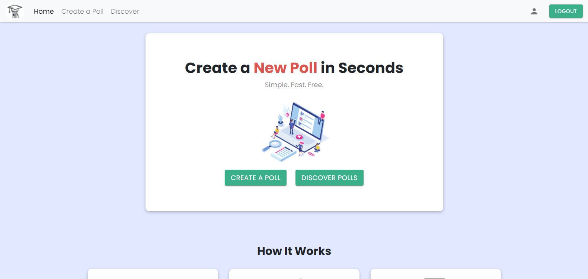 &ensp;&ensp;&ensp;&ensp;&ensp;&ensp;&ensp;&ensp;&ensp;
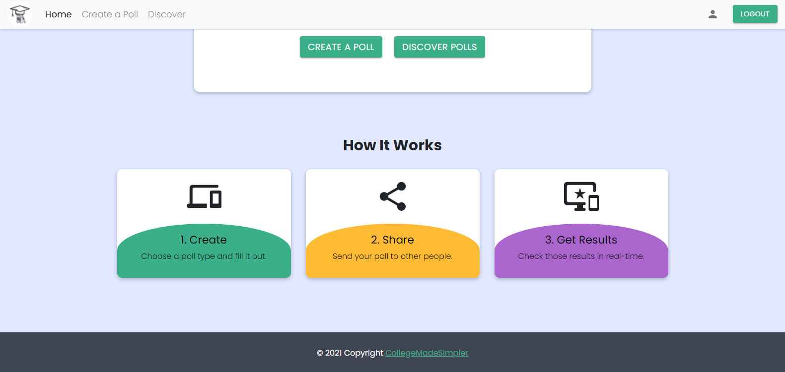 &ensp;&ensp;&ensp;&ensp;&ensp;&ensp;&ensp;&ensp;&ensp;
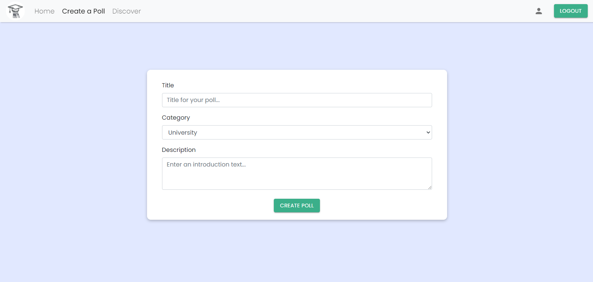 &ensp;&ensp;&ensp;&ensp;&ensp;&ensp;&ensp;&ensp;&ensp;
 &ensp;&ensp;&ensp;&ensp;&ensp;&ensp;&ensp;&ensp;&ensp;
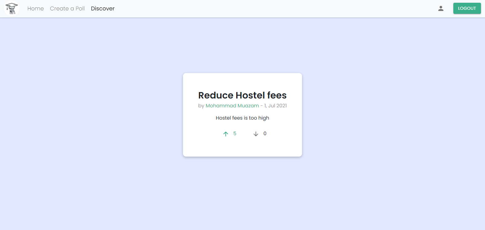 &ensp;&ensp;&ensp;&ensp;&ensp;&ensp;&ensp;&ensp;&ensp;
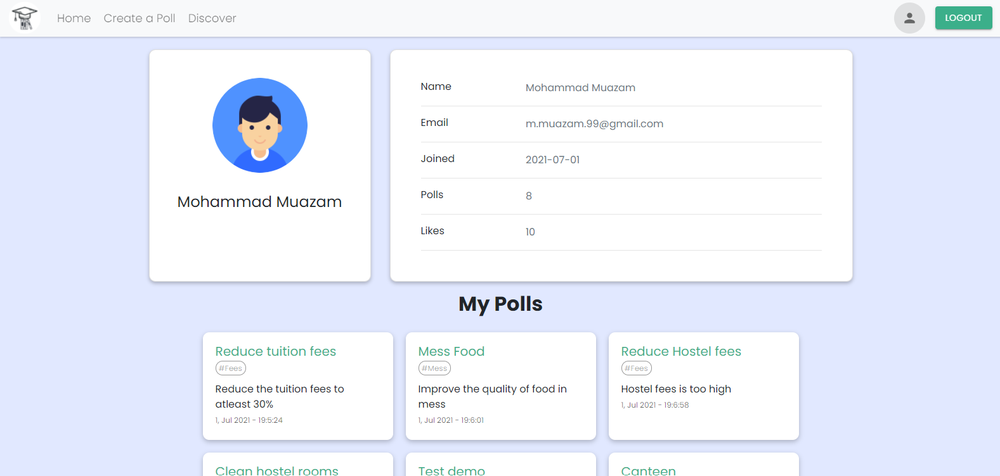 &ensp;&ensp;&ensp;&ensp;&ensp;&ensp;&ensp;&ensp;&ensp;

## Website
<a href="https://collegemadesimpler.netlify.app/" target="_blank">https://bit.ly/collegemadesimpler</a>

## Languages and Frameworks used:

 
 
 
 
  
 
 
 
 

## Community and Contributions:

When contributing to this repository, please first discuss the change you wish to make via issue, email, or any other method with the owners of this repository before making a change. Please note we have a code of conduct, follow it in all your interactions with the project.

## Found a bug? Missing a specific feature?

Feel free to **file a new issue** with a respective title and description on the repository. If you already found a solution to your problem, **we would love to review your pull request**! Have a look at our contribution guidelines to find out about our coding standards.

## Licence:

   <h1>All Contributers</h1>

 

<table>
  <tr>
         <td align="center"><a href="Muazam"> <b>Mohammad Muazam</b></a> 

    
   
    
    
  

</td>
       <td align="center"><a href="Pranjay"> <b>Pranjay Poddar</b></a> 

   
   
    
    
  

</td>

<td align="center"><a href="Chirag"> <b>Chirag Bhatia</b></a> 
    

   
   
    
    
  

  </td>
  
   <td align="center"><a href="Palak"> <b>Palak Aggarwal</b></a> 

    
   
    
    
  

</td>

</tr>
